# Fitto - AI-Supported Healthy Lifestyle, Nutrition & Social Tracking App

> 🇹🇷 Bu repo, Fitto uygulamasının public portföy sunumudur. Uygulamanın Google Play Store’da yayınlanması planlandığı için kaynak kod reposu private tutulmaktadır.

> This is a public showcase repository for Fitto. The source code is kept private because the application is planned for future release on Google Play Store.

Fitto is an AI-supported Android healthy lifestyle platform that combines nutrition tracking, personalized goal guidance, recipe and diet plan management, camera-based food recognition, social sharing, messaging, reminders and progress analytics in a single mobile application.

---

## Project Overview

Fitto was designed as a comprehensive healthy lifestyle assistant rather than a simple calorie tracking application. The application helps users track daily nutrition and lifestyle habits while also offering personalized onboarding, AI-supported guidance, recipe management, diet planning, social interaction, messaging, reminders and progress visualization.

The project focuses on making healthy living more sustainable by allowing users to manage nutrition, hydration, physical activity, sleep, weight, body measurements and personal goals from one integrated mobile experience.

One of the key strengths of Fitto is its AI-supported guidance flow. Gemini API is used to support users during target weight selection and to provide meaningful feedback based on daily user inputs such as meals, water intake, exercise records and weight progress.

---

## Project Highlights

- Personalized onboarding and calorie goal calculation
- AI-supported target weight guidance with Gemini API
- AI-powered daily progress interpretation based on user inputs
- Meal, calorie and macro tracking
- Water, exercise, sleep, step and weight tracking
- Weight and body measurement tracking
- Recipe browsing, filtering and custom recipe creation
- Shopping list and fridge inventory support
- Diet plan management and custom diet plan creation
- Intermittent fasting tracking
- Camera-based food recognition flow
- Social media features such as posts, likes, comments and following
- Direct messaging and group messaging support
- Firebase-based authentication, social data and media storage
- Health Connect integration for step and active calorie data
- Progress reports and chart-based visualization
- Reminder and notification system
- Modern Android UI with Material Design components

---

## Main Modules

### 1. Personalized Onboarding & AI Guidance

Fitto starts with a detailed onboarding flow to understand the user and generate personalized goals.

During onboarding, the application collects information such as age, height, weight, gender, activity level, goal type, target weight and goal motivation.

Based on this information, Fitto calculates daily calorie and macro targets. The application also evaluates whether the selected target is healthy, aggressive or not recommended, and provides safer guidance when needed.

Gemini API is used to support this process by generating AI-assisted explanations and recommendations for the user’s target and plan.

---

### 2. Daily Nutrition & Lifestyle Tracking

The daily tracking module is the central part of the application. It allows users to monitor their daily health and nutrition data in one place.

Users can track:

- Meals
- Calories
- Protein, carbohydrate and fat values
- Water intake
- Exercise records
- Sleep duration
- Step count
- Active calories
- Weight updates
- Body measurements

Fitto also provides AI-supported daily interpretation based on the user’s current data.

---

### 3. Camera-Based Food Recognition

Fitto includes a camera-supported meal entry flow. Users can take a photo of a meal and receive food suggestions through an external food recognition service.

The camera-based flow includes:

- Capturing a food image with CameraX
- Sending the optimized image to the food recognition API
- Listing detected food candidates
- Allowing the user to select and adjust the correct food item
- Adding selected food items to the meal log

---

### 4. Recipes & Kitchen Support

The recipe module helps users discover, save and manage healthy meal options.

Users can:

- Browse recipes
- Filter recipes by category
- View recipe details
- Save favorite recipes
- Create custom recipes
- Use cooking mode
- Add ingredients to a shopping list
- Track available ingredients with fridge inventory support

---

### 5. Diet Plans & Intermittent Fasting

Fitto supports structured diet planning for users with different goals.

Users can:

- View predefined diet plans
- Activate a selected diet plan
- Follow planned meals
- Create custom diet plans
- Manage diet plan preferences
- Track intermittent fasting sessions
- Create custom fasting plans

---

### 6. Social Media & Messaging

Fitto includes social features designed to increase motivation and user interaction.

Users can:

- Create posts
- Share healthy lifestyle content
- Like posts
- Comment on posts
- Follow other users
- View notifications
- Send direct messages
- Create and manage group conversations

Firebase services are used to support social data, real-time messaging states and media storage.

---

### 7. Reports & Progress Analytics

Fitto provides visual progress tracking through reports and charts.

Reports include:

- Calorie tracking
- Macro distribution
- Weight progress
- Body measurement progress
- Daily and historical summaries

---

### 8. Profile, Settings & Reminders

The profile module allows users to manage personal settings and preferences.

Users can manage:

- Profile information
- Weight history
- Body measurements
- Theme preferences
- Language preferences
- Notification settings
- Privacy options
- Reminder settings

Fitto includes reminder and notification support for meals, water intake, exercise, weight tracking and custom reminders.

---

## AI-Supported Features

Fitto uses Gemini API to provide intelligent guidance throughout the user journey.

AI-supported features include:

- Target weight guidance
- Healthy goal evaluation support
- Personalized plan explanation
- Daily progress interpretation
- Feedback based on meals, water, exercise and weight entries
- Motivational and informative responses

These features help Fitto act as a smart healthy lifestyle assistant rather than a passive data tracking application.

---

## Technologies Used

- Kotlin
- Android
- XML Layout
- Material Design / Material 3
- Room / SQLite
- Firebase Authentication
- Cloud Firestore
- Firebase Realtime Database
- Firebase Storage
- Gemini API
- USDA FoodData Central API
- LogMeal API
- Health Connect
- CameraX
- OkHttp
- MPAndroidChart
- WorkManager
- AlarmManager
- SharedPreferences
- Repository and DAO structures
- Fragment-based navigation

---

## Architecture

Fitto was developed using a modular Android architecture with a single Activity and multiple Fragment-based navigation structure.

Main architectural components include:

- Application layer
- Activity and Fragment-based presentation layer
- ViewModel-based state management
- Repository layer
- Local data layer with Room and DAO structures
- Remote data layer with Firebase and external APIs
- Preference / Store layer for lightweight local states
- Notification and reminder scheduling components

---

## Screenshots

| Welcome & Onboarding | Target Weight | AI / Daily Needs Result |
|---|---|---|
| 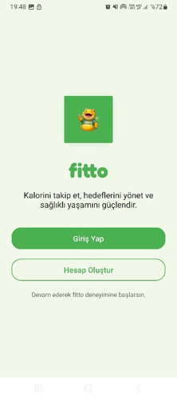 | 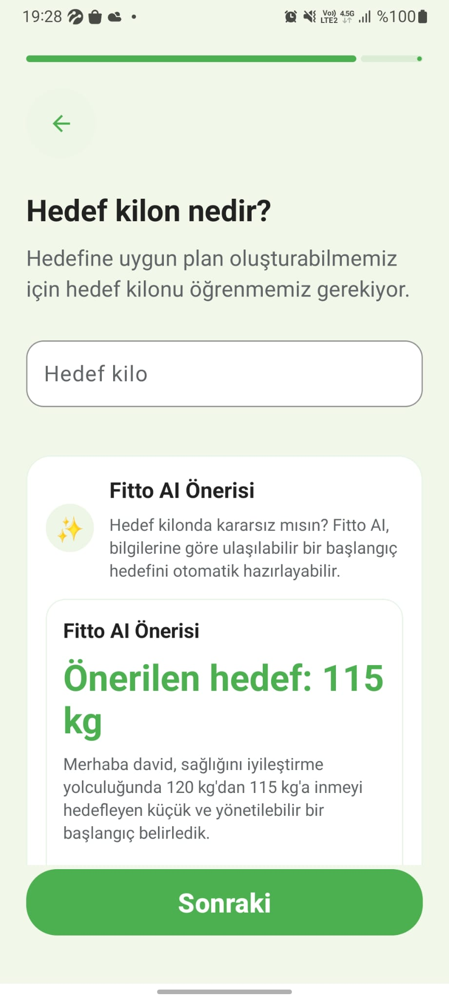 | 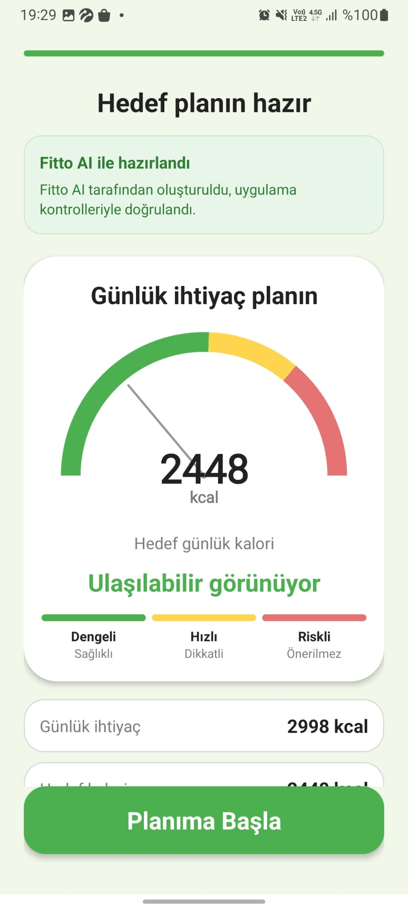 |

| Daily Tracking | Food Entry | Recipes |
|---|---|---|
| 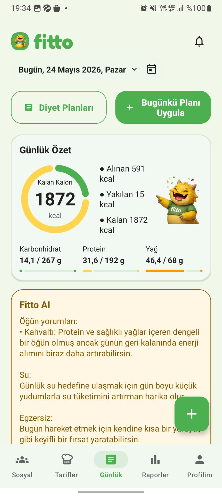 | 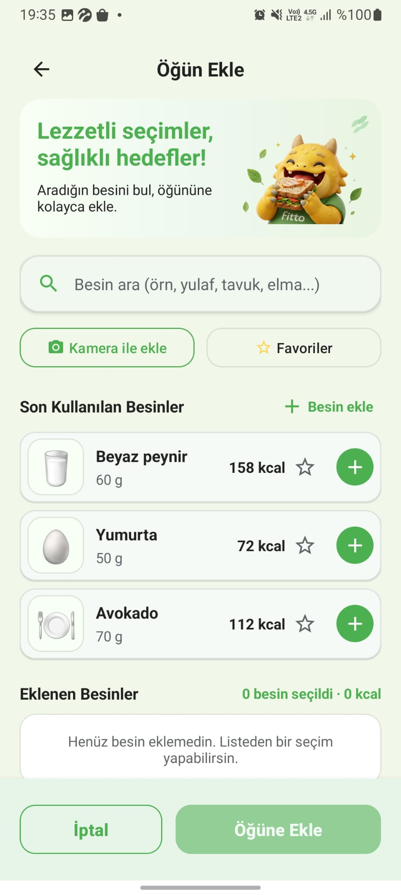 | 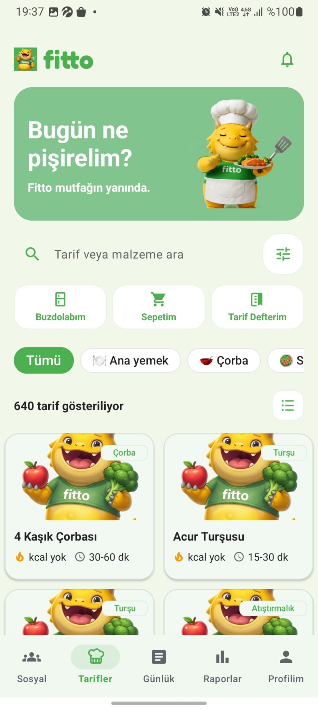 |

| Recipe Detail | Diet Plans | Social Feed |
|---|---|---|
| 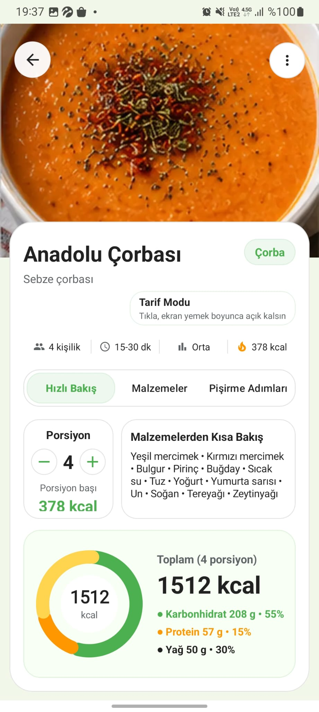 | 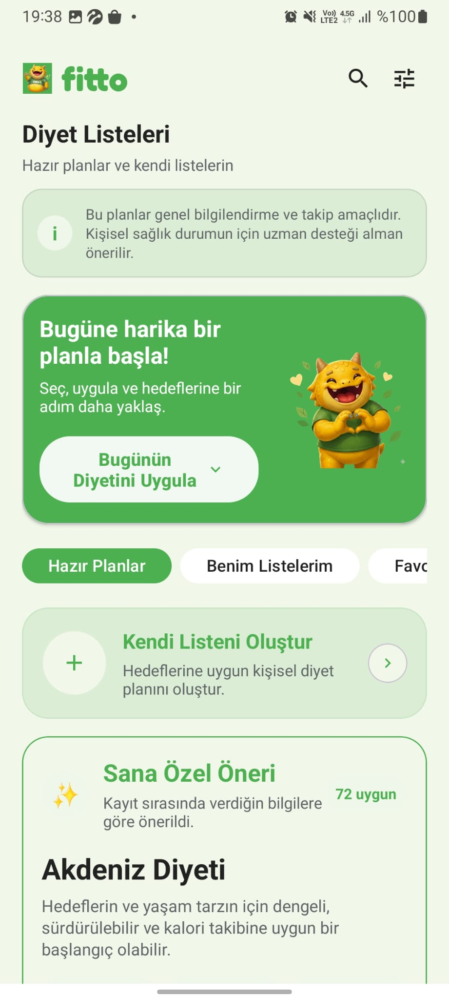 | 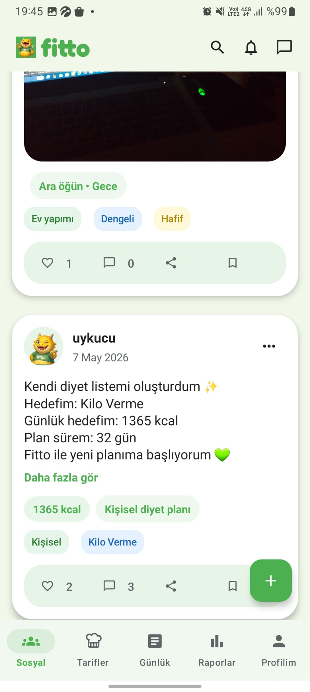 |

| Messaging | Reports | Profile |
|---|---|---|
| 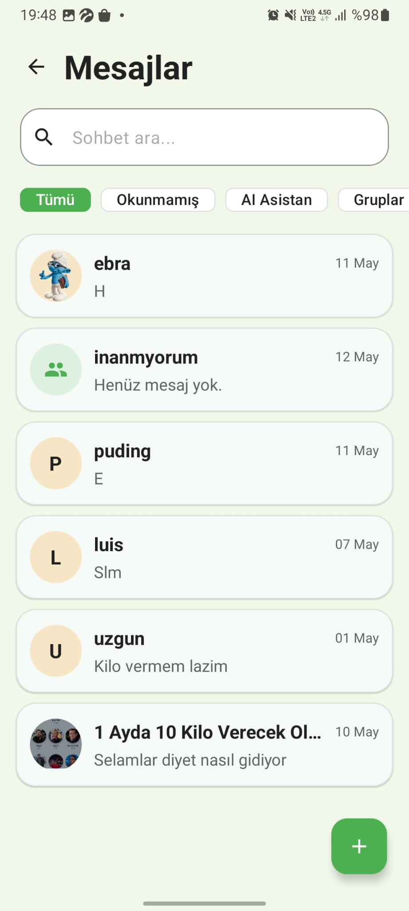 | 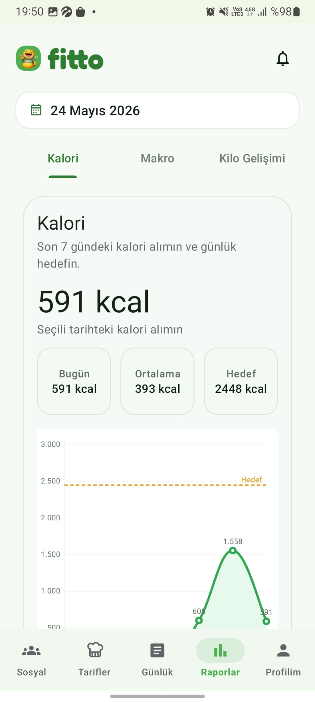 | 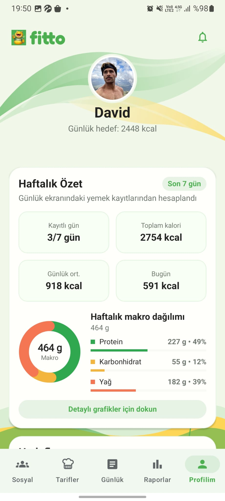 |

> Screenshots were captured using demo data. Personal health data, private messages, real user information and API keys are not shown.

---

## Contributors

This project was developed by:

- [Nursena Duyku](https://github.com/nursena-pc)
- [İrem Nur Şahin](https://github.com/Iremnursh)

---

## Project Status

Fitto is currently being improved as a portfolio project and is planned to be prepared for future release on Google Play Store.

---

## Source Code

The source code is kept private because the application is planned for future release.

---

## License

This repository is shared for portfolio and project showcase purposes.
